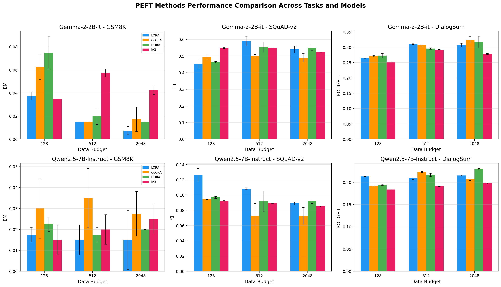
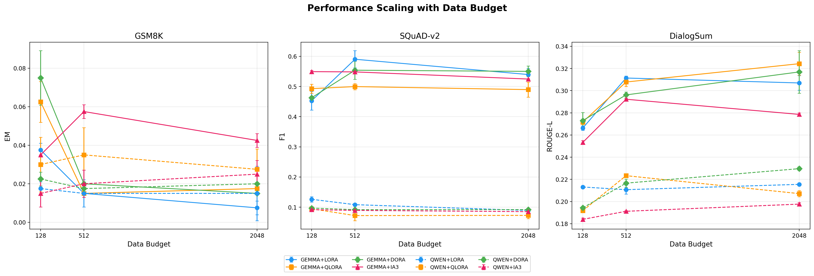
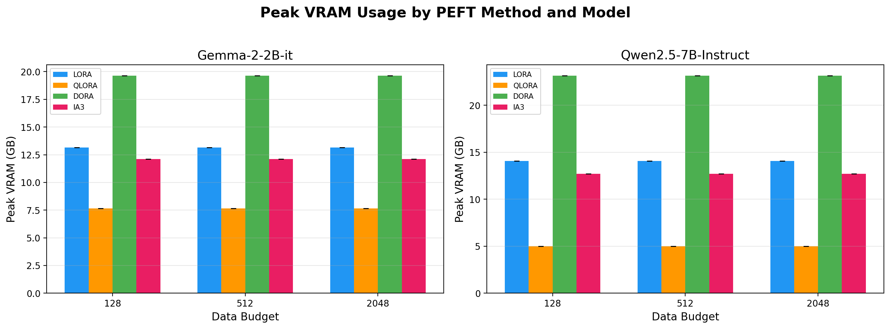
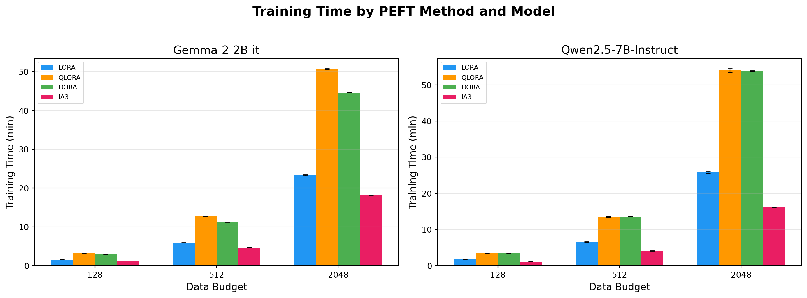
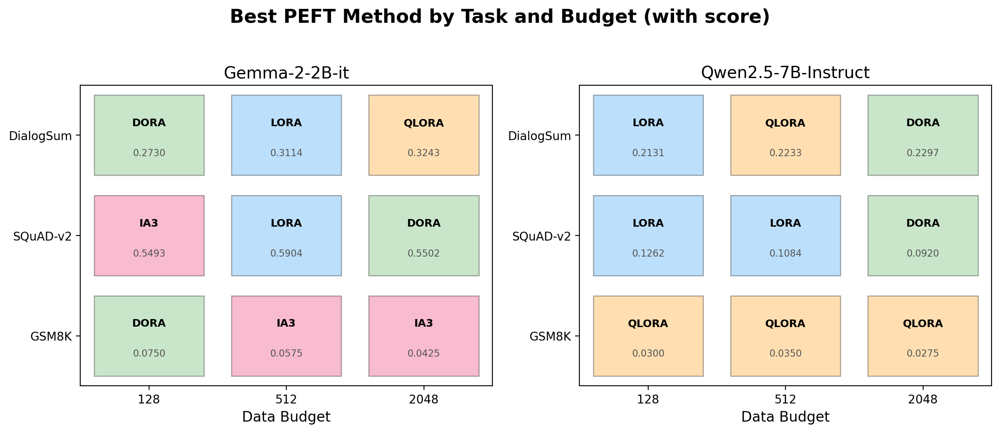
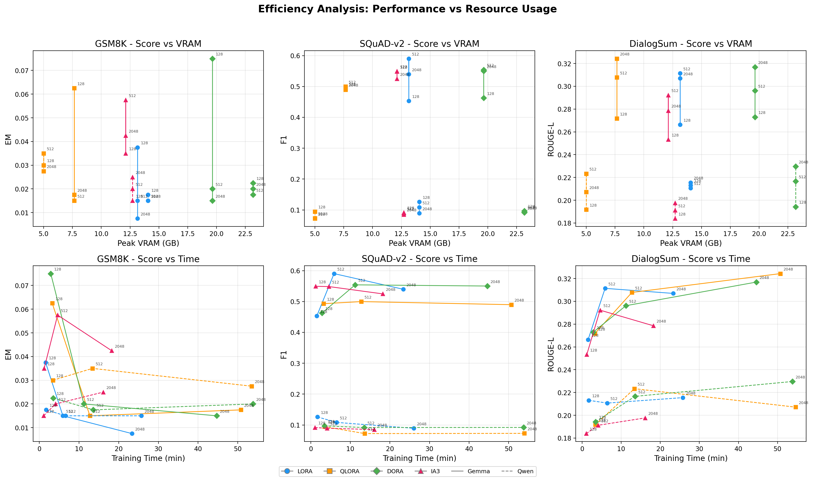
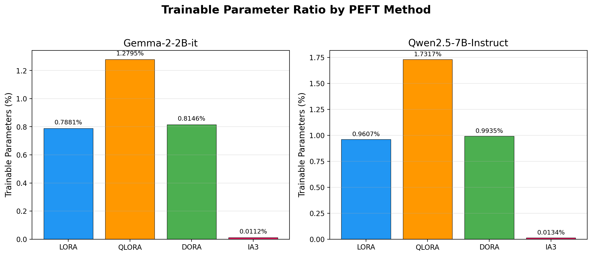
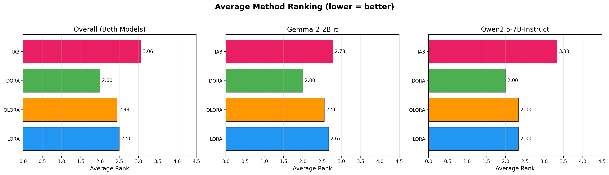
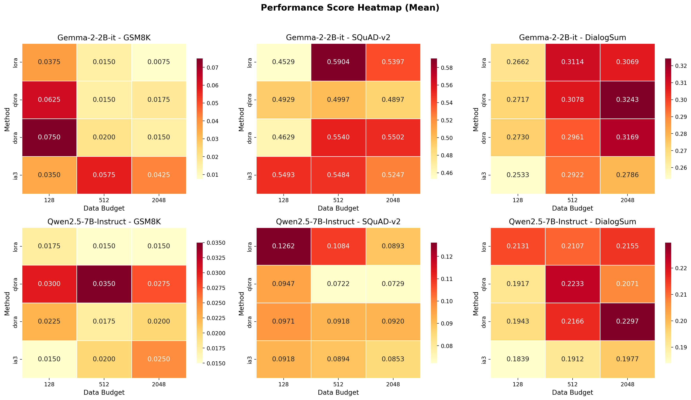
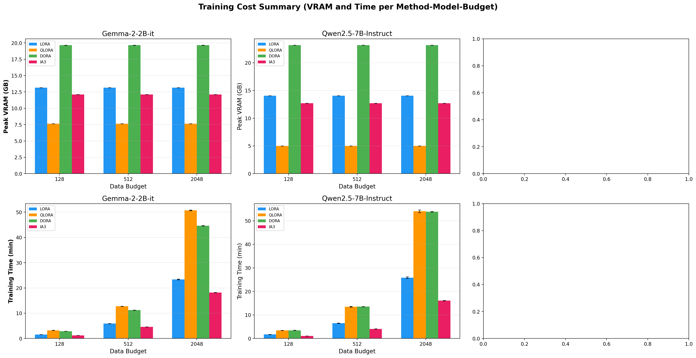

# 图表说明

**项目：** PEFT 方法在指令微调大语言模型上的实证研究
**模型：** Gemma-2-2B-it, Qwen2.5-7B-Instruct
**方法：** LoRA, QLoRA, DoRA, IA3
**任务：** GSM8K（数学推理，EM）、SQuAD-v2（阅读理解，F1）、DialogSum（对话摘要，ROUGE-L）
**数据预算：** 128 / 512 / 2048 条样本（每组 2 个随机种子）

---

## 图 1 — 主实验结果：分组柱状图

**布局：** 2 行（模型）× 3 列（任务），每个子图是分组柱状图，对比 4 种 PEFT 方法在 3 个数据预算下的表现。误差棒表示 2 个随机种子的标准差。

**用途：** 核心结果图，一张图内直接对比所有"方法×任务×模型×预算"组合。

**主要发现：**
- Gemma 在 SQuAD-v2 和 DialogSum 上的绝对分数普遍高于 Qwen，可能与这些基准以英文为主、Gemma 的英文预训练更强有关。
- 在 GSM8K 上，两个模型的 EM 分数都极低，说明数学推理在少样本微调下难以学会。
- 没有单一方法在所有配置中都占优——最佳方法因配置而异。

---

## 图 2 — 性能随数据预算的变化趋势（折线图）

**布局：** 1 行 × 3 列（每个任务一列）。每条线代表一种"模型+方法"组合，实线为 Gemma，虚线为 Qwen，数据点标注了对应的预算值。

**用途：** 展示每种方法的性能如何随数据预算从 128 增长到 2048 而变化，揭示扩展趋势及各方法是否同等受益于更多数据。

**主要发现：**
- 在 SQuAD-v2（Gemma）上，LoRA 和 DoRA 随预算增长有明显提升，而 IA3 较早出现平台期。
- 在 DialogSum 上，DoRA 和 QLoRA 的上升趋势比 LoRA 和 IA3 更稳健。
- Qwen 在 GSM8K 上所有方法、所有预算都接近零分，可能需要重新审视模型与策略的匹配。

---

## 图 3 — 各方法峰值显存占用对比

**布局：** 1 行 × 2 列（每个模型一列）。分组柱状图展示每种方法在每个预算下的峰值 GPU 显存消耗（GB）。

**用途：** 直接回应 TA 反馈中关于"效率"的要求。显存往往是 LLM 微调的主要瓶颈，尤其是较大模型。

**主要发现：**
- DoRA 显存占用最高（Gemma ~19.6 GB，Qwen ~23.2 GB），因为它需要同时学习幅度和方向分量。
- IA3 最省显存（两个模型均 ~12.1 GB），训练参数比 DoRA 少 70 倍以上。
- QLoRA 显存显著低于 LoRA，尽管可训练比例更高，因为它将基模型量化到了 4-bit。
- 显存不随预算变化——仅取决于模型和 PEFT 配置，与数据集大小无关。

---

## 图 4 — 各方法训练时间对比

**布局：** 1 行 × 2 列（每个模型一列）。分组柱状图展示每种方法在每个预算下的实际训练时间（分钟）。

**用途：** 与图 3 配合，构成完整的效率分析。训练时间随预算线性增长，反映各方法的计算成本。

**主要发现：**
- 训练时间与数据预算大致成正比（4 倍预算 ≈ 4 倍时间），符合预期。
- IA3 在所有预算下最快，与其极少的参数更新量一致。
- QLoRA 比 LoRA 更慢，尽管显存更低，原因在于量化/反量化带来的额外开销。
- Qwen（7B）的所有方法训练时间都长于 Gemma（2B），反映了更大的模型规模。

---

## 图 5 — 每个配置下的最佳方法

**布局：** 1 行 × 2 列（每个模型一列）。3×3 网格（任务 × 预算），每个单元格标注了最佳方法名称及其分数，背景按方法着色。

**用途：** 提供快速参考：在每个"模型×任务×预算"配置下哪种方法获胜。便于发现规律，例如"DoRA 在大数据量下倾向于在摘要任务上胜出"。

**主要发现：**
- 在 Gemma + SQuAD-v2 上，获胜者从 IA3（budget=128）→ LoRA（budget=512）→ DoRA（budget=2048）切换，正是 TA 提到的"转折点"。
- 在 Qwen + GSM8K 上，QLoRA 始终获胜，但所有分数都很低。
- 没有单一方法在所有设置中占优，方法选择需要考虑具体的任务和预算。

---

## 图 6 — 效率分析：性能 vs 资源消耗（散点图）

**布局：** 2 行 × 3 列。第一行：各任务的分数 vs 显存；第二行：各任务的分数 vs 训练时间。每个数据点标注了预算值，实线 = Gemma，虚线 = Qwen。

**用途：** 核心效率图。越靠近左上角的方法，用更少资源获得更高性能，位于 Pareto 前沿。同一 x 坐标上不同 y 值的点揭示了哪种方法在同等资源下提取了更多性能。

**主要发现：**
- IA3 始终位于低显存、低时间区域，资源效率最高，但绝对分数往往偏低。
- DoRA 达到了有竞争力的分数，但资源消耗最高（两条轴上都最靠右）。
- 在 SQuAD-v2（Gemma）上，Gemma+LoRA 在 budget=512 的点接近 Pareto 前沿——适中的时间获得了较高的 F1 分数。
- 每个点标注的预算值（128、512、2048）可以追踪每种方法的扩展轨迹。

---

## 图 7 — 各方法可训练参数比例

**布局：** 1 行 × 2 列（每个模型一列）。柱状图展示每种方法可训练参数占总参数的百分比。

**用途：** 解释各方法在显存和训练时间上差异的原因。可训练参数比例是每种 PEFT 配置的固定属性，与数据预算无关。

**主要发现：**
- IA3 训练的参数最少（两个模型均 ~0.01%），解释了它的速度优势和低显存占用。
- LoRA 和 DoRA 训练参数量相近（~0.8-1.0%），DoRA 略高，因为需要额外学习幅度向量。
- QLoRA 可训练比例最高（~1.3-1.7%），因为虽然基模型被量化为 4-bit，但适配器本身保持全精度。

---

## 图 8 — 各方法平均排名

**布局：** 1 行 × 3 列。左：两个模型综合排名；中：仅 Gemma；右：仅 Qwen。横向柱状图，平均排名 1.0 = 始终最优，4.0 = 始终最差。

**用途：** 将 144 组实验结果聚合为直观的排名，回答"平均来看哪种方法最好"，同时承认排名因配置而异。

**主要发现：**
- 在 Gemma 上，IA3 平均排名最优（常在 budget=128 即数据稀少时获胜，此时参数效率最重要）。
- 在 Qwen 上，排名分布更均匀，没有明确的赢家。
- 总体来看，没有方法的平均排名低于 2.0，确认方法选择应根据具体任务和预算来决定。

---

## 图 9 — 性能分数热力图（均值）

**布局：** 2 行（模型）× 3 列（任务）。每个子图为热力图，纵轴为方法，横轴为预算，单元格值为平均性能分数，从浅黄（低分）到深红（高分）着色。

**用途：** 紧凑的彩色摘要表，一目了然。颜色越深代表性能越好，便于快速发现规律。

**主要发现：**
- 在 Gemma + SQuAD-v2 上，LoRA + budget=512（F1=0.5904）出现明显的"热点"，是整个研究中表现最好的单一配置。
- 在 GSM8K 上，两个模型的热力图整体偏浅色，反映了该任务在低数据量下的普遍困难。
- 预算轴（128 → 2048）上的颜色变化因方法和任务而异——有些方法从额外数据中受益更多。

---

## 图 10 — 训练成本汇总（显存与时间）

**布局：** 2 行 × 3 列。第一行：各方法在每个预算下的显存占用，按模型分列；第二行：各方法在每个预算下的训练时间，按模型分列。

**用途：** 将图 3 和图 4 的信息合并为一张综合资源成本参考图，适合放在报告的"效率分析"章节。

**主要发现：**
- 第一行（显存）显示方法选择决定显存，预算无影响——同一方法组内的柱子完全相同。
- 第二行（时间）显示与预算的线性关系，方法间的时间差异主要由可训练参数量和量化开销驱动。
- 两行合在一起，可以回答这个实际问题："如果我只有 X GB 显存和 Y 分钟时间，应该选哪种方法和多少预算？"
